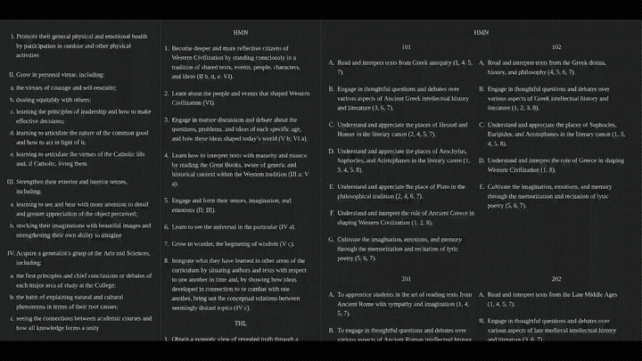
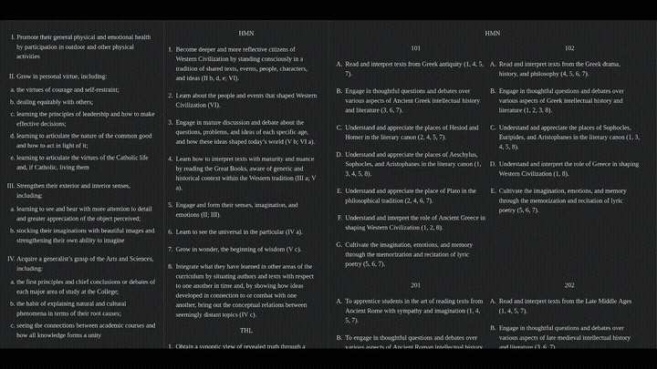

# WCC Goal Viewer

The interactive web page for exploring how individual course goals support the goals of different curricular tracks and ultimately the primary goals of Wyoming Catholic College's entire curriculum.

The first column lists Program Goals; the second, Track Goals; and the third, Course goals. Clicking on an element in either the first or second column will highlight the elements in the remaining two columns that work in support of that particular goal. Clicking on an element in the third column opens up a selector for rating goal achievement, which will be propagated back through the first two columns.

A public version can be found [her](https://wyomingcatholic.edu/goals.html). When you are ready for more, try adding ?editor=true to the end of the url to enable the editor functionality used for maintenance. Please not that the public version is partially broken due to edits made by WCC's webmaster, so consider cloning this repository to try everything locally.

Select a program goal:

Selecting a track goal:

Using the rating system:

